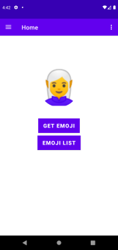

# Emoji App: Android 6+

This is a basic **Android** app using `Kotlin` language, that get emojis from [Github API](https://docs.github.com/en/free-pro-team@latest/rest/reference/emojis)

This project uses **AndroidX** [Navigation](https://developer.android.com/guide/navigation/navigation-getting-started)

Home screen                 |  Loading Screen | Random emoji
:--------------------------:|:-------------------------:|:-------------------------:
 |  | 

## Built With

* [Navigation](https://developer.android.com/guide/navigation/navigation-getting-started)- Androidx Navigation UI
* [Retrofit](https://square.github.io/retrofit) - Provides a declarative Swift API for processing values over time
* [Room Database](https://developer.android.com/training/data-storage/room) - Local storage database 
* [Hilt](https://developer.android.com/training/dependency-injection/hilt-android#kotlin) - Dependency injection built on top of the popular DI library [Dagger](https://developer.android.com/training/dependency-injection/dagger-basics)

## Getting Started

1. Clone this repo with [git](git-scm.com)
2. Open the cloned folder with latest [Android Studio]()
3. Run in a emulator or in a device
4. Click on button **`Get Emoji`** to show a random emoji from **Github** API